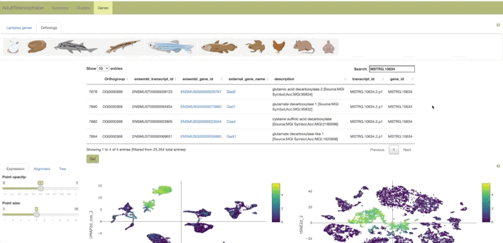
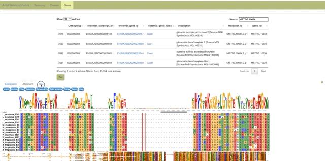

# LampreyBrainAtlas
## A comprehensive single-cell atlas of the sea-lamprey brain
This resource allows to interactively explore the single-cell atlases of the adult and larval sea-lamprey (*Petromyzon marinus*) brain obtained using scRNA-seq.

The atlas can be accessed here: [lampreybrain.kaessmannlab.org](https://lampreybrain.kaessmannlab.org/).

**Citation:** put citation here

# Usage 
Within each stage, click on any of the four main brain regions to open its relative atlas:

Each atlas is divided into three main tabs: **Taxonomy**, **Clusters**, and **Genes**.

## Taxonomy tab
The **Taxonomy** tab displays cell type relationships in the form of an interactive cell type tree.
Clicking on any tip of the tree will highlight the location of the cells belonging to the selected cell type in the UMAP and tSNE embeddings and will open a table showing its top 100 marker genes. By hitting the **Go to gene!** button after selecting a gene from the table it is possible to explore gene expression patterns and other features stored in the **Genes** tab.

## Clusters tab
The **Clusters** tab contains interactive UMAP and tSNE plots of the annotated atlases.

## Genes tab
The **Lamprey genes** tab shows all genes annotated from the sea-lamprey genome. Additional information is displayed for genes with matches to SwissProt (top blastp hit). Genes without any match display only their gene_id (e.g., MSTRG.6115).

The **Orthologs** tab shows sea-lamprey genes that are orthologous to any of the displayed species. Mouse orthologs are linked to the mouse brain gene expression [atlas](http://mousebrain.org/) from the Linnarson lab. Use the search field to retrieve any gene from the corresponding tab, select it by clicking on it and hit the **Go!** button to visualize its expression and other features.

The **Expression** tab displays expression information for each selected gene.
**Top:** Scatter plots showing gene expression for each cell in UMAP and tSNE space.
**Middle:** Violin plot showing gene expression distribution within each cell type.
**Bottom:** Barplot showing the proportion of cells expressing the selected gene within each cell type.

The **Alignment** tab displays mutliple protein sequence alignments between the selected lamprey gene and its homologs in the species present in the Orthologs tab.

The **Trees** tab shows gene trees obtained from the previous alignments.The **Reconciled** button allows to visualize the species-tree-reconciled gene tree. The **Choose tree style** drop down menu allows to select several tree visualization options.

